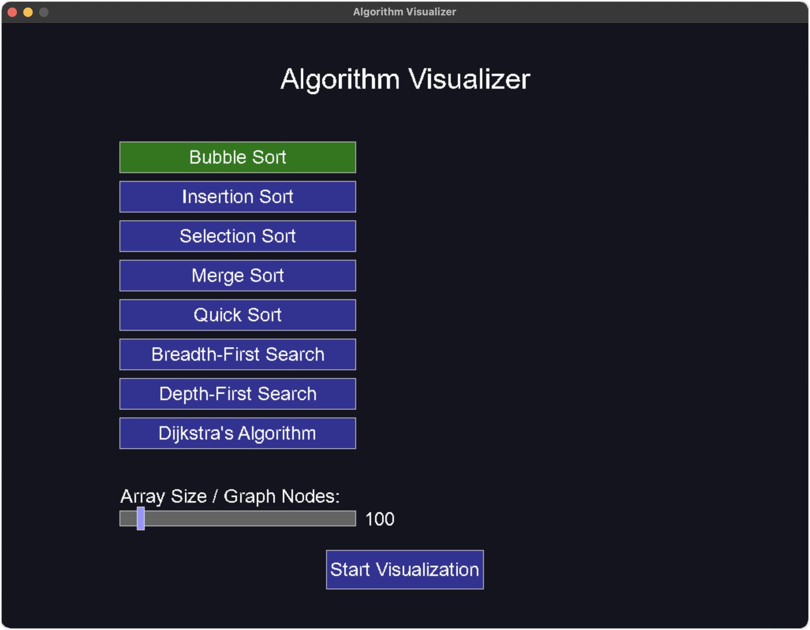

# Algorithm Visualizer

This interactive application visualizes common sorting and graph algorithms. It's designed to help computer science students and enthusiasts understand how different algorithms work through step-by-step visualization.



## Features

- **Sorting Algorithm Visualizations**:
  - Bubble Sort
  - Insertion Sort
  - Selection Sort
  - Merge Sort
  - Quick Sort

- **Graph Algorithm Visualizations**:
  - Breadth-First Search (BFS)
  - Depth-First Search (DFS)
  - Dijkstra's Algorithm

- **Interactive Controls**:
  - Pause/Resume visualization
  - Adjust array size and graph complexity
  - Return to menu to select different algorithms

## Installation

### Prerequisites

This project requires SDL2 and SDL2_ttf libraries.

#### macOS

Using Homebrew:

```bash
brew install sdl2 sdl2_ttf
```

#### Ubuntu/Debian

```bash
sudo apt-get install libsdl2-dev libsdl2-ttf-dev
```

#### Windows

1. Download SDL2 development libraries for MinGW from [SDL2 website](https://www.libsdl.org/download-2.0.php)
2. Download SDL2_ttf from [SDL2_ttf website](https://www.libsdl.org/projects/SDL_ttf/)
3. Extract both to a convenient location
4. Add the bin directories to your PATH environment variable

### Building from Source

1. Clone the repository:

```bash
git clone https://github.com/ADJB1212/AlgorithmViz.git
cd AlgorithmViz
```

2. Build the project:

```bash
make
```

This will compile the project and create an executable named `algo`.

3. Run the application:

```bash
./algo
```

## Usage

1. **Start the Application**: Run the executable to launch the menu screen.

2. **Select an Algorithm**: Click on any of the available algorithms from the menu.

3. **Customize Parameters**: Adjust the array size or graph complexity using the slider.

4. **Start Visualization**: Click the "Start Visualization" button to begin.

5. **Controls During Visualization**:
   - `Space`: Pause/Resume the visualization
   - `Esc`: Return to the menu screen

## Font Requirement

The application requires the Arial font. Make sure `arial.ttf` is in the same directory as the executable, or modify the source code to use a different font.

## Technical Details

### Project Structure

- **main.c**: Entry point and application initialization
- **visualizer.c**: Core visualization logic
- **algorithms.c**: Implementation of all algorithms
- **ui.c**: User interface components
- **graph.c**: Graph data structure and rendering

### Building on Different Platforms

#### macOS

The default Makefile is configured for macOS with Homebrew-installed SDL2. If your installation is in a different location, update the `CFLAGS` and `LDFLAGS` in the Makefile.

#### Linux

You might need to modify the Makefile:

```makefile
CC = gcc
CFLAGS = -Wall -Wextra -I/usr/include/SDL2
LDFLAGS = -lSDL2 -lSDL2_ttf -lm

SRC = main.c visualizer.c algorithms.c ui.c graph.c
OBJ = $(SRC:.c=.o)
EXECUTABLE = algo

all: $(EXECUTABLE)

$(EXECUTABLE): $(OBJ)
	$(CC) $(OBJ) -o $@ $(LDFLAGS)
	rm -f $(OBJ)

%.o: %.c
	$(CC) $(CFLAGS) -c $< -o $@

clean:
	rm -f $(OBJ) $(EXECUTABLE)

run: $(EXECUTABLE)
	./$(EXECUTABLE)
```

#### Windows with MinGW

```makefile
CC = gcc
CFLAGS = -Wall -Wextra -IC:/SDL2/include -IC:/SDL2_ttf/include
LDFLAGS = -LC:/SDL2/lib -LC:/SDL2_ttf/lib -lSDL2 -lSDL2_ttf -lm

SRC = main.c visualizer.c algorithms.c ui.c graph.c
OBJ = $(SRC:.c=.o)
EXECUTABLE = algo.exe

all: $(EXECUTABLE)

$(EXECUTABLE): $(OBJ)
	$(CC) $(OBJ) -o $@ $(LDFLAGS)
	rm -f $(OBJ)

%.o: %.c
	$(CC) $(CFLAGS) -c $< -o $@

clean:
	rm -f $(OBJ) $(EXECUTABLE)

run: $(EXECUTABLE)
	./$(EXECUTABLE)
```

Replace `C:/SDL2/` and `C:/SDL2_ttf/` with your actual SDL2 installation paths.

## Troubleshooting

### SDL2 Library Not Found

- **macOS**: Verify SDL2 installation with `brew list sdl2 sdl2_ttf`
- **Linux**: Check installation with `ldconfig -p | grep SDL`
- **Windows**: Ensure SDL2 and SDL2_ttf DLLs are in your system PATH or in the same directory as the executable

### Compilation Errors

- Check that all header files are correctly included
- Verify that SDL2 development libraries are properly installed
- Make sure the compiler can find the SDL2 headers (check CFLAGS)

### Runtime Errors

- Font not found: Place `arial.ttf` in the executable directory
- Window creation failed: Check SDL initialization and video driver support